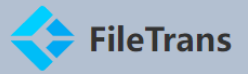
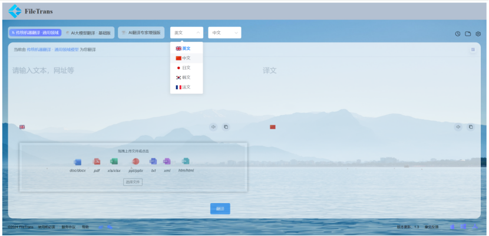
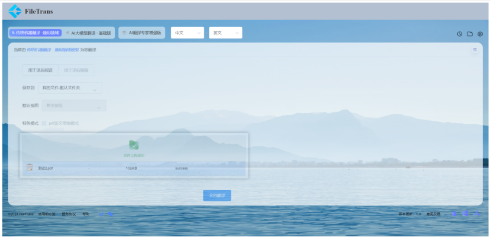
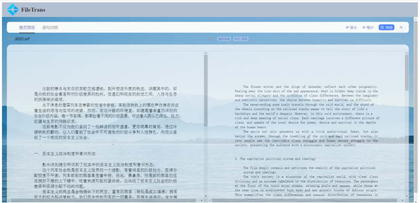

<div align="center">
    
</div>
<div align = "center">
	<h1 align = "center">FileTrans</h1>    
    <h4 align = "center">File Translation Web System</h4>
</div>


### 请点击以下网址体验
### （此系统将在6月20日部署到公网上）


##  UI界面

<div align = "center">
    
    
    
</div>


## 项目概述

### 项目基本介绍

FileTrans是一个基于Web的翻译系统，用户可以通过公网访问，无需下载安装任何软件。这个系统提供了一个用户友好的界面，使得用户可以轻松地进行文本和文档的翻译。


### FileTrans的功能特性

- 多语言支持：支持包括英语、中文、法语、日语、韩语等在内的多种语言翻译。
- 文档格式兼容性：能够处理多种文档格式，如 XML、HTML、XLS、XLSX、PPT、PPTX、DOC、DOCX、TXT，确保用户可以翻译各种类型的文档。
- 在线对比与同步滚动：提供原文和译文的在线对比功能，并支持同步滚动，方便用户进行实时校对和编辑。
- 文档缩放功能：用户可以根据需要调整文档的显示大小，以便更清晰地查看内容。
- 公网访问：作为一个Web系统，FileTrans可以通过任何连接到互联网的设备访问。
- 翻译文档下载：用户可以在翻译完成后，轻松地将译文保存为PDF文件。

### 使用方法

使用 FileTrans 非常简单，用户只需在浏览器中输入系统的网址，选择所需的语言和文档格式，上传文档或输入文本，然后点击“翻译”按钮即可。

## 目录结构描述

```.
.
├── css/  # 存放样式文件
│   ├── index.css  # 首页样式文件
│   ├── index.less  # 首页样式文件的扩展
│   ├── element.css  # Element UI 的样式文件
│   └── fonts/  # 字体文件夹
│       └── element-icons.ttf  # Element UI 的图标字体文件
├── js/  # 存放JavaScript文件
│   ├── index.js  # 首页主脚本文件
│   ├── axios.min.js  # Axios库的最小化版本，用于HTTP请求
│   ├── cookies.js  # 用于处理cookie的工具
│   ├── element.js  # Element UI 的主脚本文件
│   ├── md5.js  # 用于生成MD5加密的工具
│   ├── vue.js  # Vue.js 框架的主文件
│   └── vue-uploader.js  # 用于处理文件上传的Vue.js插件
├── imgs/  # 存放图像文件
│   ├── logo.png  # 网站logo
│   └── background.jpg  # 背景图片
├── index.html  # 网站首页HTML文件
├── Node.js/  # 存放Node.js相关文件
│   ├── apps.js  # 应用程序的主文件
│   ├── Translate.js  # 处理翻译功能的模块
│   ├── res/  # 用于存放翻译之后的文档
│   ├── tmp/  # 存放上传的文档
│   ├── uploader-node.js  # 处理文件上传的Node.js脚本
│   ├── package.json  # 项目依赖和配置信息
│   └── package-lock.json  # 记录项目依赖的确切版本
```

##  版本内容更新

   - FileTrans v1.3

## 协议

 

>**警告**
>
>除GPLv3许可下的源代码外，其他方均禁止使用FileTrans的名义作为下载器应用，FileTrans的衍生产品亦同。
>衍生品包括但不限于分叉和非官方构建。
